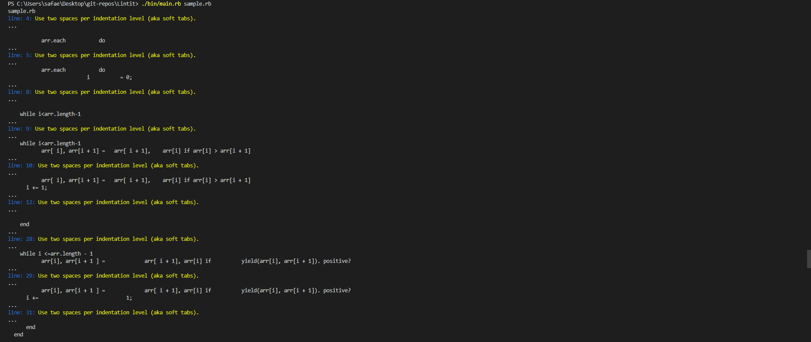
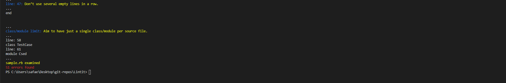
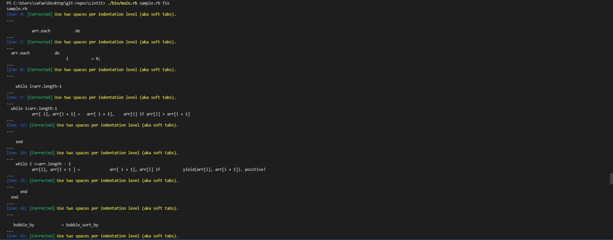
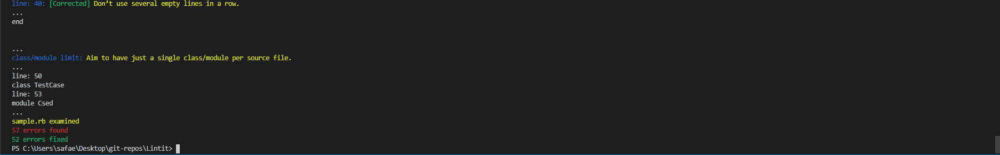

<h3 align="center">Lintit - A Custom Linter developed in Ruby to check Ruby files</h3>

## About <a name = "about"></a>

<h3 align="center"> This custom code linter is the Capstone Project for the Ruby Course. The main goal is to put into practice the main concepts of Object Oriented Programming. Particularly, classes and access to their attributes.</h3>

<p align="center">
https://www.loom.com/share/3376f5d490b34dabb99676334cdd0c7f
</p>

<h2 align="center">How to Install</h2>

<h3>Downloading</h3>

1- Download this repository,

2- Unpack it,

3- Copy its address,

4- Open your terminal commandline,

5- Write "cd" and paste the address of the folder that you unpacked the repo

6- ⚠️ TO EXECUTE THE FILE WITHOUT ANY ERROR INSTALL COLORIZE GEM: ⚠️

```

  gem install colorize

```

<h3>Cloning</h3>

1- Copy repo address,

```

  https://github.com/SafaErden/Lintit.git

```

2- Open your terminal commandline,

3- Run git clone,

```

  git clone https://github.com/SafaErden/Lintit.git

```

4- ⚠️ TO EXECUTE THE FILE WITHOUT ANY ERROR INSTALL COLORIZE GEM: ⚠️

```

  gem install colorize

```

<h2>How to Use</h2>

After setting up the repo and installing the colorize gem, run the following command to execute the linter in the repo directory on your commanline,

```

  ./bin/main.rb <filename_tocheck.rb>

```

In this case a sample file is created for the reviewers to check the code,

```

  ./bin/main.rb sample.rb

```

Running the desired file without any additional argument will return the broken lines with line number and explanation,



At the end of each return, the user will be informed about the number of detected cases,



To fix the detected errors, add fix keyword after the filename

```

  ./bin/main.rb sample.rb fix

```

Using fix command will fix the detected cases and inform the user about progress with [CORRECTED] info,



In this case, user also will be informed about the total fixed cases,



<h2>Abilities</h2>

1. Check and fix the indentation misusage : Use two spaces per indentation level (aka soft tabs).

```

 # bad - four spaces
def some_method
    do_something
end

# good
def some_method
  do_something
end

```

2. Check and fix the line between methods : Use empty lines between method definitions and also to break up methods into logical paragraphs internally.

3. Check the line length : Limit lines to 50 characters.

4. Check the number of classes/modules per page : Aim to have just a single class/module per source file.

5. Check and fix the semi colon misusage : Don’t use ; to terminate statements and expressions.

```

# bad
puts 'foobar'; # superfluous semicolon

# good
puts 'foobar'

```

6. Chceck and fix the spaces after bang : 'No space after !.

```

# bad
! something

# good
!something

```

7. Chceck and fix the spaces aruond braces : No spaces after (, [ or before ], ). Use spaces around { and before }.

```

# bad
some( arg ).other
[ 1, 2, 3 ].each{|e| puts e}

# good
some(arg).other
[1, 2, 3].each { |e| puts e }

```

8. Chceck and fix the white spaces : Avoid trailing whitespace.

---

## 🔧 Built with<a name = "built_using"></a>

- [Ruby](https://www.ruby-lang.org/) - Ruby
- [Rspec](https://www.rspec.com) - A test driven framework

## ✒️ Autor <a name = "author"></a>

👤 **Safa ERDEN**

- Github: [@SafaErden](https://github.com/SafaErden)
- Twitter: [@safaerden](https://twitter.com/safaerden)
- Linkedin: [@safaerden](https://www.linkedin.com/in/safaerden/)

## 🤝 Contributing

Contributions, issues and feature requests are welcome!

Feel free to check the [issues page](https://github.com/SafaErden/Lintit/issues).

## 👍 Show your support

Give a ⭐️ if you like this project!

## 📝 License

This project is free to use as learning purposes. For any external content (e.g. logo, images, ...), please contact.
